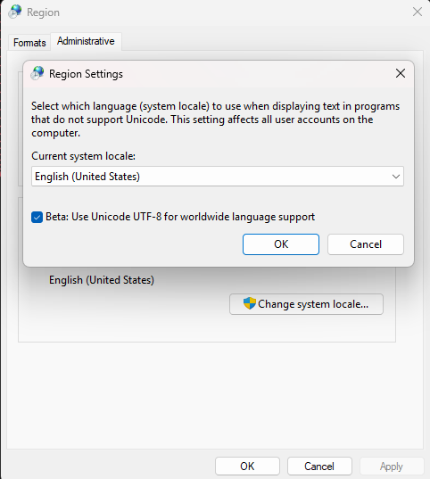

Setting up the environment
==========================

Installing the dependencies
---------------------------

ESP-Docs
""""""""

::

    pip install --user esp-docs

This will pull in all the necessary dependencies such as Sphinx, Breathe, etc.

.. note::
   The installed esp-docs may not be added to your PATH environment variable yet at this moment. On Windows 11 navigate to "Edit environment variables for your account" -> Path -> New -> Add the path.

   To get this ``path_to_bin_folder``, try entering ``pip uninstall esp-docs``, you will see something like:
   ::

      Found existing installation: esp-docs 1.3.0
      Uninstalling esp-docs-1.3.0:
      Would remove:
      /Users/dummy/Library/Python/3.10/bin/build-docs
      /Users/dummy/Library/Python/3.10/bin/deploy-docs
      /Users/dummy/Library/Python/3.10/lib/python/site-packages/esp_docs-1.3.0.dist-info/*
      /Users/dummy/Library/Python/3.10/lib/python/site-packages/esp_docs/*

   The path before ``build-docs`` is your bin path.

Cairo SVG
""""""""""
CairoSVG is an SVG 1.1 to PNG, PDF, PS and SVG converter. You can install it as follows:

::

   pip3 install cairosvg

If you have issues, please check out `CairoSVG documentation <https://cairosvg.org/documentation/>`__.

Doxygen
"""""""

Download from the official website `Doxygen <https://www.doxygen.nl/download.html>`__.

.. warning::
   You also have to do this, or it wont work:

   Navigate to *Control panel* -> *Clock and region* -> *Region* -> *Administrative* -> *Change system locale* -> *Beta: Use Unicode UTF-8*
   
   A restart is needed afterwards.

    Setting Unicode UTF-8
